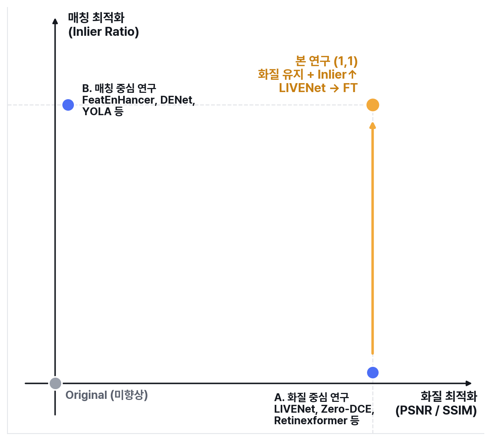
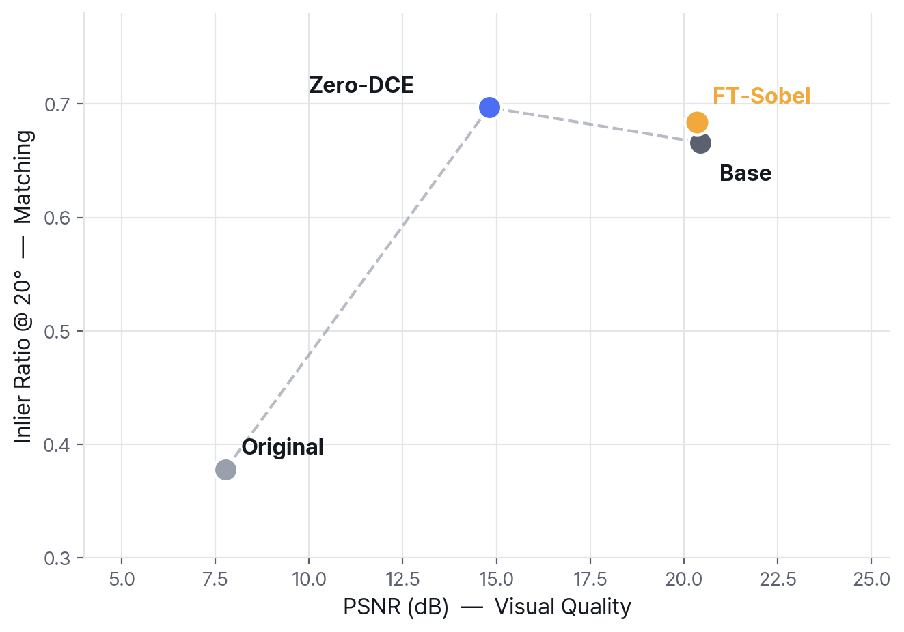
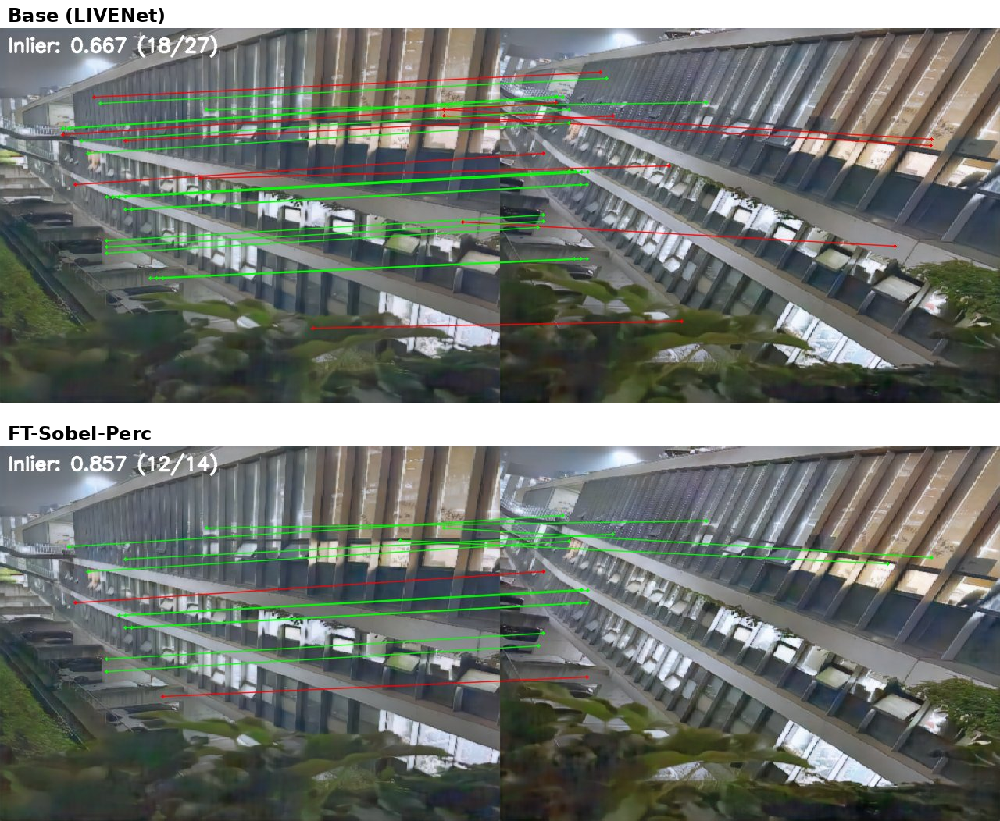
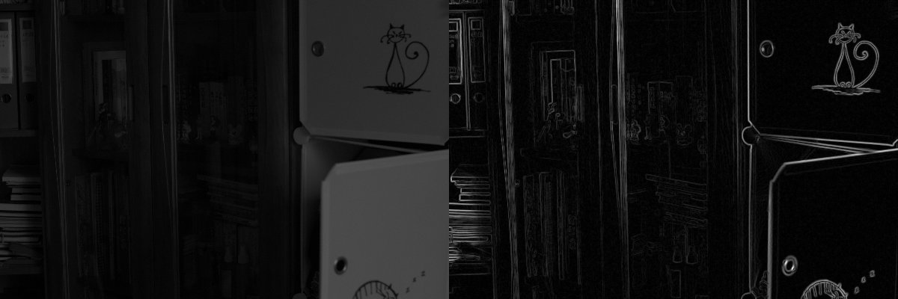
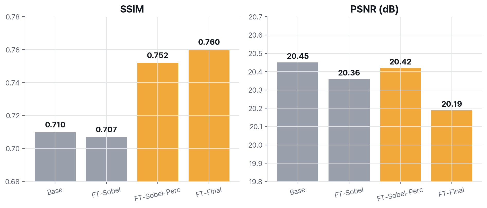

# Low-Light Enhancement × Matching Fine-tuning (LIVENet)

화질(PSNR)은 유지하면서, 저조도 향상 모델 LIVENet을 매칭(LoFTR Inlier Ratio) 친화적으로
Fine-tuning하는 방법을 연구한 프로젝트입니다.

---

## 연구 지형

기존 연구는 화질 중심(A) 또는 매칭 중심(B) 한쪽 끝에 머무릅니다.
본 연구(D)는 화질 중심 모델(LIVENet)을 출발점으로, 화질을 유지한 채
매칭 성능을 끌어올리는 방향(1,1)을 지향합니다.

- A. 화질 중심 (LIVENet, Zero-DCE, Retinexformer 등) — 매칭 미고려
- B. 매칭 중심 (FeatEnHancer, DENet, YOLA 등) — 화질 보존 미고려
- C. 단순 결합 분석 — 기존 화질 모델을 재학습 없이 매칭 알고리즘과 결합, A 위치에 머무름
- D. 본 연구 — 화질 모델(A)을 출발점으로 화질 유지하며 매칭 성능 개선

---

## 문제의식: 화질-매칭 Trade-off

Zero-DCE → LIVENet(Base)로 갈수록 PSNR은 향상되지만 Inlier Ratio는 오히려 감소합니다.

원인은 텍스처/엣지 보존 부족으로 분석됩니다. Laplacian 텍스처량이 Zero-DCE는 275,
Base는 71로 크게 감소했으며, 이는 LIVENet이 디노이징 과정에서 고주파 텍스처/엣지를
과도하게 제거해 매칭 성능이 함께 떨어진 것으로 해석됩니다.

---

## 핵심 결과

| Model | PSNR | SSIM | LOL 20° | LOL 30° | Night Total |
|---|---|---|---|---|---|
| Original | 7.77 | 0.191 | 0.378 | 0.000 | 0.719 |
| Base (LIVENet) | 20.45 | 0.710 | 0.666 | 0.532 | 0.658 |
| FT-Sobel | 20.36 | 0.707 | 0.684 | 0.588 | 0.688 |
| **FT-Sobel-Perc** | 20.42 | 0.752 | 0.685 | 0.548 | **0.712** |
| FT-Final | 20.19 | 0.760 | 0.681 | 0.567 | 0.647 |

- **FT-Sobel**: 구조 변경 없이 Sobel edge loss만 추가 — 화질 거의 유지(PSNR -0.09), LOL 전 구간 Inlier 개선(평균 +0.022, 30°에서 +0.056)
- **FT-Sobel-Perc**: Perceptual(LPIPS) loss 추가 — 야간 실환경 11쌍 실측에서 향상 모델 중 1위(0.712, Original 0.719과 거의 동등), SSIM도 함께 개선(0.710→0.752)
- **FT-Final**: 구조 수정(hf_branch) + 4개 손실 결합 — LOL 통제실험 최고지만 실환경에서는 오히려 Base보다 낮음(-0.011, Occam's Razor)

최종 선택 모델: **FT-Sobel-Perc**

---

## 정성적 결과: 매칭 시각화

야간 실측 장면(place3, hard 난이도)에서 Base 대비 FT-Sobel-Perc는
오매칭(빨간선)이 줄고 정매칭(초록선)이 크게 늘어납니다.

| | Base | FT-Sobel-Perc |
|---|---|---|
| Inlier Ratio | 0.667 (18/27) | 0.857 (12/14) |

화질 향상에 사용한 Sobel/Perceptual loss가 실제 매칭 정확도 개선으로 이어짐을
정성적으로도 확인할 수 있습니다.

---

## (선택) Sobel Edge Loss

Sobel 필터(1차 미분 기반 엣지 검출)로 추출한 엣지맵의 차이를 손실 함수에 직접 반영하는
방식입니다. `Sobel Loss = |Sobel(향상 이미지) - Sobel(GT)|`

---

## (선택) SSIM 개선 효과

Sobel loss만 사용했을 때는 SSIM 변화가 거의 없었으나(0.710→0.707),
Perceptual loss를 추가하자 SSIM이 뚜렷하게 상승했습니다(0.752, FT-Final 0.760).
반면 PSNR은 거의 변화가 없어, 이는 픽셀 충실도가 아닌 구조적 유사성 차원의 개선으로 해석됩니다.

---

## 파일 구성

| 파일 | 설명 |
|---|---|
| `finetune_sobel.py` | Sobel edge loss 기반 fine-tuning |
| `finetune_sobel_perc.py` | Sobel + Perceptual(LPIPS) loss 기반 fine-tuning |
| `finetune_final.py` | 구조 수정(hf_branch) + 4개 손실 결합 fine-tuning |
| `finetune_seq.py` | 순차적(sequential) fine-tuning — ft_sobel_perc 체크포인트에서 hf_branch+FFT 추가 학습 |
| `eval_psnr_ssim.py` | PSNR / SSIM 측정 |
| `eval_final.py` | LOL eval15 각도별(10°~30°) Inlier Ratio 평가 |
| `eval_night_final.py` | 야간 실측 11쌍 Inlier Ratio 평가 |
| `blocks.py` | LIVENet 모델 구조 (hf_branch 추가 버전) |
| `blocks_backup.py` | LIVENet 모델 구조 (원본) |

## 사용 모델

- **LIVENet**: 저조도 이미지 향상 모델 (Generator + Refiner), 본 연구의 Fine-tuning 대상
- **LoFTR**: Transformer 기반 이미지 매칭 모델, 가중치 고정(frozen) 후 손실 계산·평가에만 사용

## 평가 지표

- **PSNR / SSIM**: 향상 이미지와 GT 사이의 화질 유사도
- **Inlier Ratio**: LoFTR 매칭점 중 RANSAC 기하 검증을 통과한 비율 (매칭 정확도)
